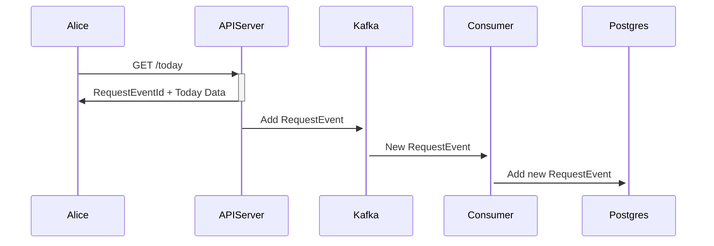
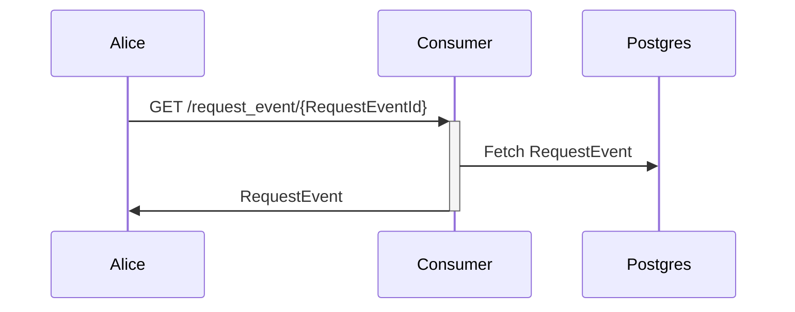

# ramlich
Rust version of https://github.com/vanng822/vncalendar
And some testing of Rust around this and different frameworks/packages

## Flows
Request for /today



Request for RequestEvent



## Build api/web/task applications
- Solar <=> Lunar converter using actix-web
- Swagger http://localhost:8181/swagger-ui/#/crate

## Kafka & DB
Drop some events from web and some consumer to pick up and store in Postgres
- https://docs.rs/rdkafka/latest/rdkafka/
- https://docs.rs/tokio-postgres/latest/tokio_postgres/

## Killswitch
Feature switch using Unleash
- https://www.getunleash.io/

```bash
open http://localhost:4242/
```
username: admin
password: unleash4all

## Dockerize
Create docker for applications

```bash
make build
```

```bash
docker compose up
```


```bash
open http://localhost:8585/request_event/$(curl http://localhost:8181/today | jq -r .meta.request_event_id)
```
If all go fast you should expect some response else refresh the link!

## Other
- Single instance with once_cell
- Sending async with async-trait
- Json with serde
- HTTP request, proxy with reqwest, awc and actic-web
- build mod/lib/crate
- Writting tests
- Macros, Inline, Conversion


## Todos
- Cross compiling
- ...?